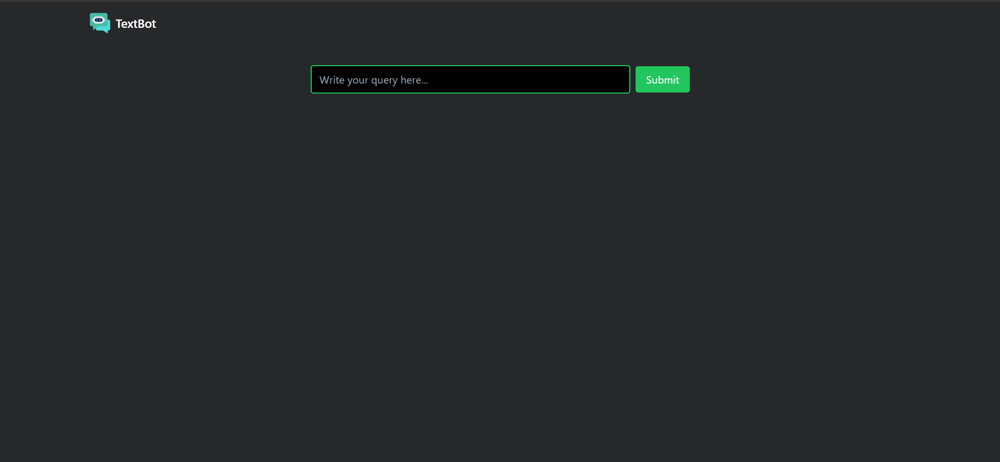

# TextBot

## Description

A powerful AI assistant, built on Google AI's innovative Gemini technology, stands ready to assist you.  Simply pose your questions, and receive informative answers within seconds.

## Installation

Make sure you have Node.js and npm installed on your machine. Then, run the following commands:

```bash
# Clone the repository
git clone https://github.com/chinmoyT/TexttBot.git

# Navigate to the project directory
cd your-app-name

# Install dependencies
npm install
```
# To start the development server
```
npm run dev
```
# Contributing
If you'd like to contribute to this project, feel free to fork the repository and submit a pull request. Contributions, issues, and feature requests are welcome!

# Screenshots

